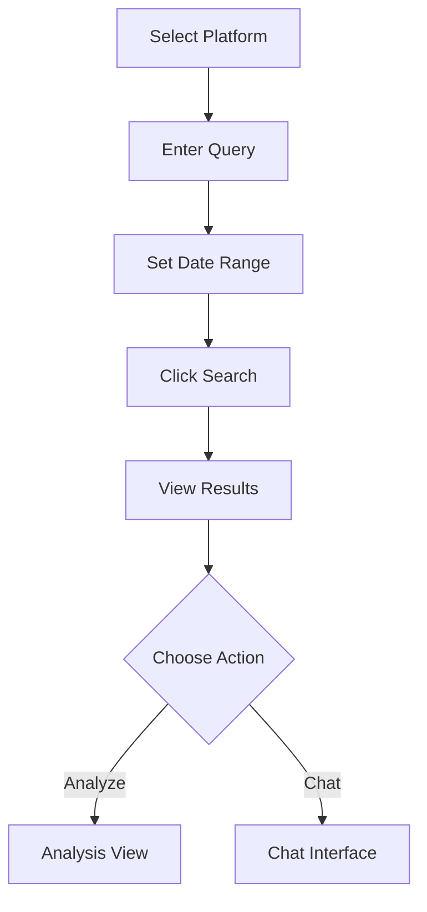
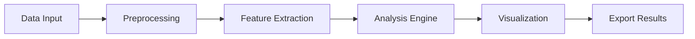
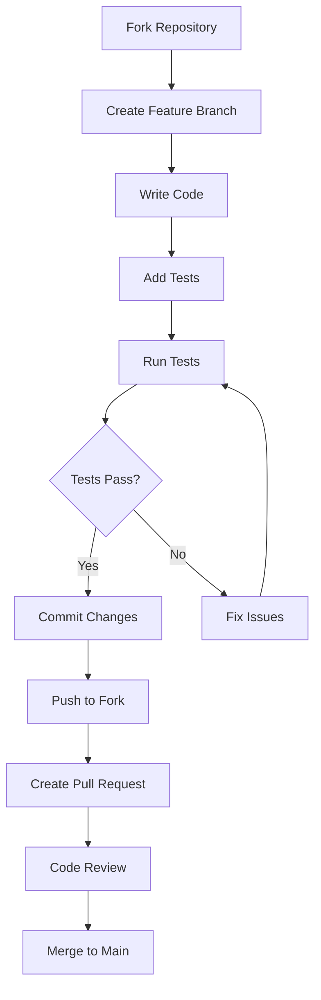

# 📊 Multiverse Insights — Real-time Social Media Analyzer

<div align="center">

[](https://opensource.org/licenses/MIT)
[](https://www.python.org/downloads/)
[](https://streamlit.io/)
[](https://github.com/yourusername/multiverse-insights/commits/main)
[](https://github.com/yourusername/multiverse-insights/issues)


**A next-generation multimodal social media analytics platform for real-time insights and AI-powered analysis.**

</div>

---

## 🌟 Table of Contents

* [Features](#-features)
* [Quick Start](#-quick-start)
* [Installation Guide](#-installation-guide)
* [Configuration](#-configuration)
* [Usage](#-usage)
* [Project Structure](#-project-structure)
* [API Documentation](#-api-documentation)
* [Development Guide](#-development-guide)
* [Testing & CI](#-testing--ci)
* [Troubleshooting](#-troubleshooting)
* [Contributing](#-contributing)
* [License](#-license)
* [Acknowledgments](#-acknowledgments)
* [Contact & Support](#-contact--support)

---

## 🔍 Features

### Multi-Platform Data Collection

|      Platform | Capabilities                                  |   Status   |
| ------------: | --------------------------------------------- | :--------: |
|    **Reddit** | Posts, comments, metadata, subreddit analysis |  ✅ Active  |
|   **Twitter** | Tweets, user interactions, engagement metrics |  ✅ Active  |
|   **YouTube** | Video content, comments, viewer statistics    |  ✅ Active  |
|  **Telegram** | Channel messages, group analytics             | 🚧 Planned |
| **Instagram** | Posts, stories, engagement data               | 🚧 Planned |

### Advanced Analytics Engine

* **Sentiment Analysis** — multi-dimensional classification with confidence scores.
* **Emotion Detection** — joy, anger, sadness, fear, surprise.
* **Trend Detection** — real-time trend identification and short-term prediction.
* **Entity Recognition** — people, organizations, locations, products.
* **Relationship Extraction** — graph connections among entities.
* **Anomaly Detection** — statistical outlier and spike detection.
* **Controversy Scoring** — scale 0–1 to measure controversiality.

### AI-Powered Features

* **RAG Chatbot** — context-aware question answering over collected corpora.
* **Vector Database** — embeddings + FAISS for fast similarity search.
* **Natural Language Queries** — ask in plain English.
* **Conversation Memory** — maintain short-term chat history for context.

### Visualization & Reporting

* **Dynamic Dashboards** — interactive, real-time charts.
* **Sentiment Heatmaps** — geographic and temporal visualization.
* **Cross-Platform Comparison** — side-by-side metrics across platforms.
* **Export Options** — PDF, CSV, JSON, PNG.

---

## 🚀 Quick Start

### Prerequisites

```bash
# Python 3.8+
python --version

# pip
pip --version
```

### One-command install (example)

```bash
git clone https://github.com/yourusername/multiverse-insights.git
cd multiverse-insights
python -m venv venv
source venv/bin/activate
pip install -r requirements.txt
```

### Quick launch (local)

```bash
# start streamlit UI
streamlit run streamlit_app1.py

# then open http://localhost:8501
```

---

## 🛠️ Installation Guide

### Step 1 — Clone repository

```bash
git clone https://github.com/yourusername/multiverse-insights.git
cd multiverse-insights
```

### Step 2 — Virtual environment

```bash
# Create virtual environment
python -m venv venv

# Activate (Linux/Mac)
source venv/bin/activate

# Activate (Windows)
venv\Scripts\activate
```

### Step 3 — Install dependencies

```bash
# Install all required packages
pip install -r requirements.txt

# Verify installation
pip list
```

### Step 4 — Download models

```bash
# Create models directory
mkdir -p models

# Download Qwen model (example - change to actual model URL)
wget -O models/Qwen2.5-7B-Instruct.Q5_K_M.gguf \
  https://huggingface.co/Qwen/Qwen2.5-7B-Instruct-GGUF/resolve/main/qwen2.5-7b-instruct-q5_k_m.gguf

# Verify model download
ls -la models/
```

### Step 5 — Configuration setup

```bash
# Copy example configuration
cp config/config.example.json config/config.json

# Edit configuration file
nano config/config.json  # or use your preferred editor
```

---

## ⚙️ Configuration

### Required files

| File                   | Purpose                | Location            |
| ---------------------- | ---------------------- | ------------------- |
| `twitter_cookies.json` | Twitter authentication | Project root        |
| `youtube_cookies.json` | YouTube authentication | Project root        |
| `config/config.json`   | Application settings   | `config/` directory |

**Security note:** keep cookies and credentials out of version control. Use `.gitignore` and environment variables for secrets.

### Example `config/config.json`

```json
{
  "models": {
    "qwen_model_path": "models/Qwen2.5-7B-Instruct.Q5_K_M.gguf",
    "embedding_model": "sentence-transformers/all-MiniLM-L6-v2",
    "max_tokens": 4096,
    "temperature": 0.7
  },
  "vector_db": {
    "path": "temp_vector_db",
    "chunk_size": 1000,
    "overlap": 200
  },
  "scraping": {
    "max_results": 100,
    "rate_limit": 60,
    "timeout": 30
  },
  "ui": {
    "theme": "dark",
    "auto_refresh": false,
    "cache_enabled": true
  }
}
```

### Platform-specific setup

#### Twitter authentication

1. Log in to Twitter in your browser.
2. Open Developer Tools (F12) → Application/Storage.
3. Copy cookies as JSON and save as `twitter_cookies.json`.


---

## 📖 Usage

This section follows the Table of Contents order: Data Collection → Data Analysis → Chat Interface → Exporting & Examples.

### 1) Data Collection (UI)

* Choose platform → enter query → set date range → click **Search**.
* Results are shown for inspection; select **Analyze** to run the pipeline and visualize results.

#### Social Media Search (flow)



#### File Upload

1. Navigate to **Custom File Analysis** tab.
2. Upload JSON file (max 100MB).
3. Select analysis type.
4. Click **Process** and view results.

### 2) Data Analysis

#### Analysis Workflow



#### Available analyses

* **Executive Summary** — AI-generated overview.
* **Sentiment Analysis** — emotional breakdown per platform/time.
* **Topic Modeling** — identify key themes.
* **Entity Extraction** — named entity recognition with context.
* **Anomaly Detection** — detect spikes and outliers.
* **Controversy Scoring** — measure contentiousness of content.

### 3) Chat Interface

#### Query examples

| Query Type      | Example                             | Expected Output                      |
| --------------- | ----------------------------------- | ------------------------------------ |
| Topic Query     | "What are the main topics?"         | List of top topics + descriptions    |
| Sentiment Query | "How do people feel about X?"       | Sentiment breakdown with percentages |
| Entity Query    | "Who are the key people mentioned?" | List of entities with context        |
| Summary Query   | "Summarize the findings"            | Concise overview of insights         |

#### Chat features

* Natural language questions.
* Context awareness and limited short-term memory for conversation.
* Real-time responses based on processed data.
* History tracking / session export.

### 4) Exports & Reports

* Export charts & tables as PNG/CSV/JSON/PDF from every analysis view.
* Executive summaries available as downloadable PDF.

---

## 📁 Project Structure

```
multiverse-insights/
├── streamlit_app.py          # Main Streamlit application
├── ui_components.py           # UI components and functions
├── data_scrapers.py           # Social media data collection
├── utils1.py                  # Utility functions
├── rag_chatbot.py             # RAG-based chatbot
├── requirements.txt           # Python dependencies
├── config/                    # Configuration files
│   ├── config.example.json    # Example configuration
│   └── config.json            # Active configuration
├── models/                    # Model files
│   └── Qwen2.5-7B-Instruct.Q5_K_M.gguf
├── temp_vector_db/            # Temporary vector database
├── docs/                      # Documentation
├── tests/                     # Test files
├── examples/                  # Example data files & sample JSON
└── README.md                  # This file
```

### Component responsibilities

| Component           | Primary Functions                  | Dependencies        |
| ------------------- | ---------------------------------- | ------------------- |
| `streamlit_app.py` | Main application logic, routing    | All other modules   |
| `ui_components.py`  | UI rendering, interactive elements | streamlit, plotly   |
| `data_scrapers.py`  | Platform-specific data extraction  | selenium, requests  |
| `utils1.py`         | Data processing, helper functions  | pandas, numpy       |
| `rag_chatbot.py`    | RAG-based chatbot                  | transformers, faiss |

---

## 🔌 API Documentation

### Data Scrapers API

#### `scrape_reddit_data`

```python
def scrape_reddit_data(query: str, subreddit: str = None, limit: int = 100) -> Tuple[str, str]:
    """
    Scrape Reddit data for given query
    Args:
        query: Search query string
        subreddit: Specific subreddit to search (optional)
        limit: Maximum number of posts to retrieve
    Returns:
        Tuple of (filename, error_message)
    """
```

#### `scrape_twitter_data`

```python
def scrape_twitter_data(query: str, start_date: str = None, end_date: str = None) -> Tuple[str, str]:
    """
    Scrape Twitter data for given query and date range
    Args:
        query: Search query string
        start_date: Start date in YYYY-MM-DD format
        end_date: End date in YYYY-MM-DD format
    Returns:
        Tuple of (filename, error_message)
    """
```

#### `scrape_youtube_data`

```python
def scrape_youtube_data(query: str, max_results: int = 10) -> Tuple[str, str]:
    """
    Scrape YouTube data for given query
    Args:
        query: Search query string
        max_results: Maximum number of videos to retrieve
    Returns:
        Tuple of (filename, error_message)
    """
```

### Analysis API

#### `analyze_sentiment`

```python
def analyze_sentiment(text: str) -> Dict[str, Any]:
    """
    Analyze sentiment of given text
    Returns:
        Dictionary with sentiment scores and explanations
    """
```

#### `extract_entities`

```python
def extract_entities(text: str) -> List[Dict[str, str]]:
    """
    Extract named entities from text
    Returns:
        List of dictionaries with entity information
    """
```

> **Tip:** Add explicit JSON schema documents to `docs/schema.md` for each scraper and the output shape. This reduces ambiguous formats and speeds up onboarding.

---

## 🛠️ Development Guide

### Setting up the dev environment

```bash
# Clone repository
git clone https://github.com/yourusername/multiverse-insights.git
cd multiverse-insights

# Create development environment
python -m venv dev_env
source dev_env/bin/activate

# Install development dependencies
pip install -r requirements.txt
pip install -r requirements-dev.txt

# Install pre-commit hooks
pre-commit install
```

### Adding new platforms

1. Create a scraper module (e.g. `scraper_<platform>.py`) and implement `scrape_<platform>`.
2. Update UI components to surface the platform in `ui_components.py`.
3. Add a configuration entry under `config/config.example.json`.

Example function stub:

```python
def scrape_new_platform(query: str, **kwargs) -> Tuple[str, str]:
    """
    Scrape data from new platform
    Args:
        query: Search query
        **kwargs: Platform-specific parameters
    Returns:
        Tuple of (filename, error_message)
    """
    # Implementation here
    pass
```

### Testing & Quality

```bash
# Run tests
pytest

# Run specific tests
pytest tests/test_scrapers.py

# Coverage
pytest --cov=. --cov-report=html
```

### Code style

```bash
# Format code
black .

# Lint
flake8 .

# Type checks
mypy .
```

---

## 🧪 Testing & CI

### Recommended CI steps (GitHub Actions)

* `lint` — run `black`, `flake8`.
* `test` — run `pytest` and coverage report.
* `build` — smoke test including model path check (no model downloads in CI unless cached).
* `release` — optional: publish artifacts on release tags.

Add GH Actions badges to the top of the README after configuring the workflows.

---

## 🐛 Troubleshooting

### Common issues

| Issue                  | Solution                                                            |
| ---------------------- | ------------------------------------------------------------------- |
| `ModuleNotFoundError`  | Activate venv and re-run `pip install -r requirements.txt`          |
| Permission denied      | Use `pip install --user` or check permissions                       |
| Model download fails   | Check network, disk space. Use a download mirror or proxy if needed |
| Chatbot not responding | Verify `config.json` model paths and vector DB location             |
| Scraping errors        | Refresh cookies, handle new site layouts, respect rate limits       |
| Out-of-memory          | Reduce chunk sizes, enable streaming, increase instance memory      |

### Debug mode

```bash
export DEBUG=true
streamlit run streamlit_app1.py --logger.level=debug
```

### Performance optimization

* Use `st.cache_data` for repeated preprocessing and `st.cache_resource` for loaded models.
* Tune `vector_db.chunk_size` and `overlap` for memory/perf tradeoffs.
* Consider lightweight embedding models for CPU-only deployments and GPU variants for production throughput.

---

## 🤝 Contributing

### Contribution workflow



### Contribution guidelines

* Follow PEP8.
* Document all public functions with docstrings.
* Add tests for new scrapers and major logic.
* Keep secrets out of PRs.
* Use conventional commits.

### Templates

* PR and Issue templates are located in `.github/`.

---

## 📄 License

This project is licensed under the **MIT License**. See the full license text below.

```
MIT License

Copyright (c) 2024 Multiverse Insights

Permission is hereby granted, free of charge, to any person obtaining a copy
of this software and associated documentation files (the "Software"), to deal
in the Software without restriction, including without limitation the rights
to use, copy, modify, merge, publish, distribute, sublicense, and/or sell
copies of the Software, and to permit persons to whom the Software is
furnished to do so, subject to the following conditions:

The above copyright notice and this permission notice shall be included in all
copies or substantial portions of the Software.

THE SOFTWARE IS PROVIDED "AS IS", WITHOUT WARRANTY OF ANY KIND, EXPRESS OR
IMPLIED, INCLUDING BUT NOT LIMITED TO THE WARRANTIES OF MERCHANTABILITY,
FITNESS FOR A PARTICULAR PURPOSE AND NONINFRINGEMENT. IN NO EVENT SHALL THE
AUTHORS OR COPYRIGHT HOLDERS BE LIABLE FOR ANY CLAIM, DAMAGES OR OTHER
LIABILITY, WHETHER IN AN ACTION OF CONTRACT, TORT OR OTHERWISE, ARISING FROM,
OUT OF OR IN CONNECTION WITH THE SOFTWARE OR THE USE OR OTHER DEALINGS IN THE
SOFTWARE.
```

---

## 🙏 Acknowledgments

Core technologies:

* Streamlit — web UI
* Hugging Face — pre-trained models
* Sentence Transformers — text embeddings
* FAISS — vector similarity search
* Qwen — language model

Thanks to contributors and early testers.

---

## 📞 Contact & Support

* **Documentation / Wiki:** [https://github.com/Prathameshsci369/Multiverse-Insights/wiki](https://github.com/Prathameshsci369/Multiverse-Insights/wiki)
* **Issues:** [https://github.com/Prathameshsci369/Multiverse-Insights/issues](https://github.com/Prathameshsci369/Multiverse-Insights/issues)
* **Maintainer:** Prathamesh Anand — [prathameshsci963@gmail.com](mailto:prathameshsci963@gmail.com)


---

<div align="center">
**⭐ Star this repo if it helped.**  
Made with ❤️ by the Multiverse Insights Team
</div>
